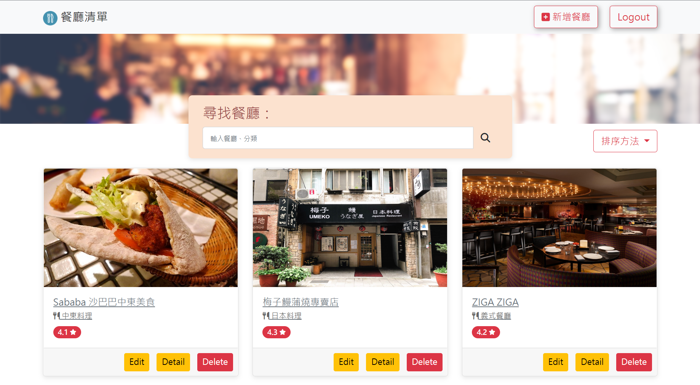
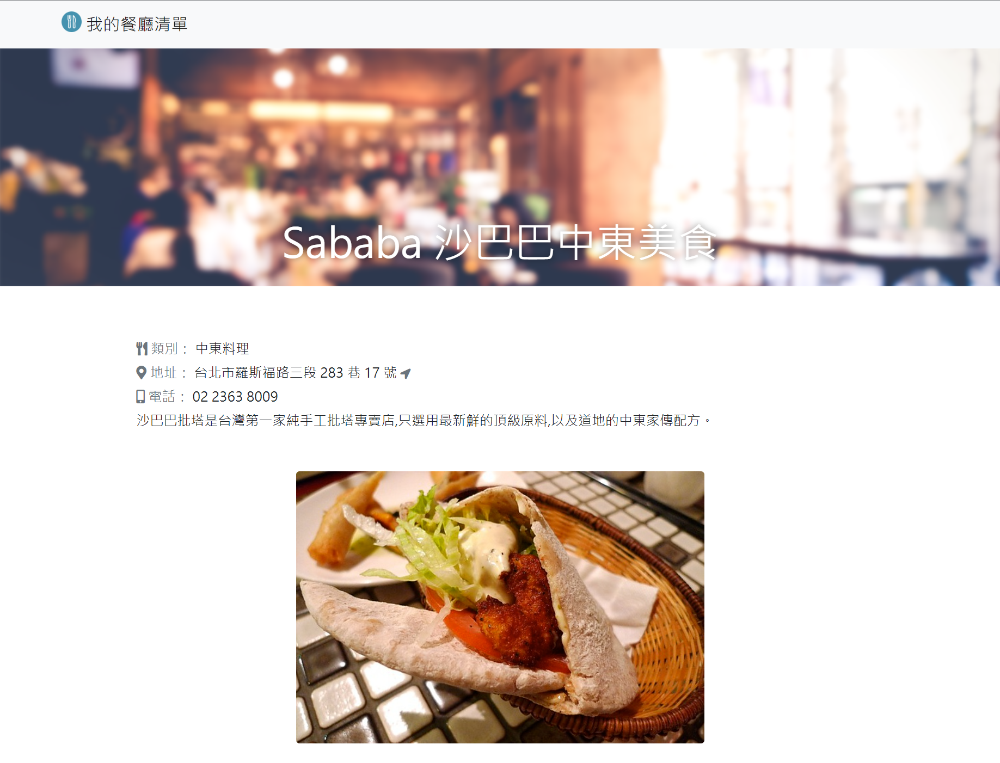
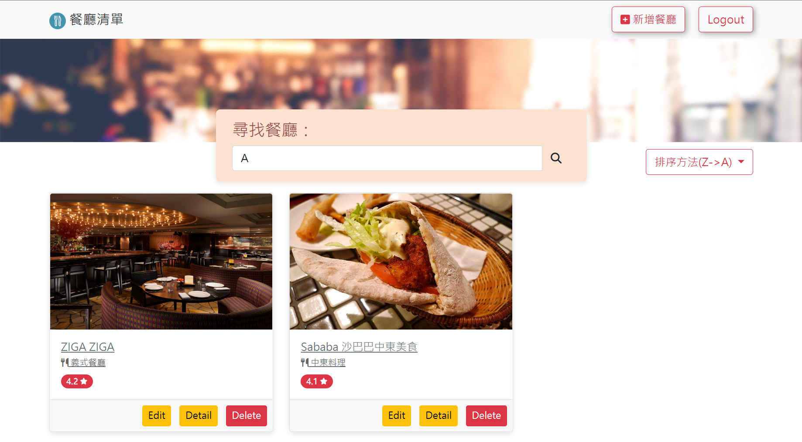
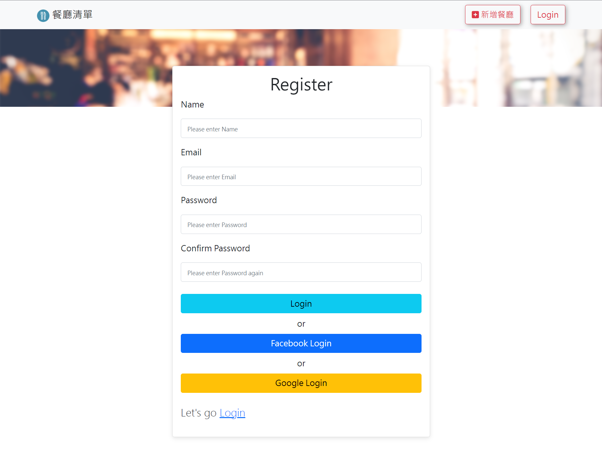

# 我的餐廳清單
練習使用Node.js & Express架設附有瀏覽清單、查看詳細資訊與查詢/編輯/刪除功能的美食餐廳清單網站。


11/05新增 
+ 使用passport加入註冊、驗證及登出功能，使用者可用Email註冊或使用Facebook、Google帳號登入使用上述功能。
+ 使用flash message提示錯誤訊息。
+ 使用bcrypt驗證及儲存密碼。
+ 使用.env管理隱密資訊、環境變數。

首頁


更多資訊


新增餐廳


編輯餐廳內容


排序(店名(升降冪)、類型、地區)


使用者註冊頁


使用者登入頁


# 功能詳情
## 登入及註冊
+ 新增使用者註冊及認證功能(flash message提示錯誤訊息)。
+ 可使用Facebook、Google帳號登入。
+ 可點選logout登出使用者。
+ 使用bcrypt儲存 & 驗證使用者密碼。
## 使用者權限功能
+ 可在首頁看到附有簡易資訊(店名、餐廳類型、評分)的餐廳清單列表。
+ 點擊餐廳可檢視詳細資訊(店名、餐廳類型、地址、地圖資訊-via google map、電話、簡介)。
+ 可透過店名及餐廳類型進行關鍵字搜尋。
+ 可新增餐廳(包含資料驗證)。
+ 可編輯餐廳內容。
+ 可刪除餐廳。
+ 可依店名(升降冪)、類型、地區排序。

# 安裝執行
1. 確認安裝node.js & npm。
2. 開啟Terminal將專案 clone 至本地位置：
```
git clone https://github.com/Gincoolwant/restaurant_list.git
```
3. 開啟Terminal並移至專案資料夾安裝使用套件： 
```
npm install
```
4. 設定環境變數，新增.env檔案(請參考.env.example)：
```
FACEBOOK_APP_ID= #Mata for Developers應用程式編號
FACEBOOK_APP_SECRET= #Meta for Developers應用程式密鑰
FACEBOOK_APP_CALLBACK=http://localhost:3000/auth/facebook/callback
GOOGLE_CLIENT_ID= #Google Cloud console OAuth 2.0 用戶端編號
GOOGLE_CLIENT_SECRET= #Google Cloud console OAuth 2.0 用戶端密鑰
GOOGLE_APP_CALLBACK=http://localhost:3000/auth/google/callback
SESSION_SECRET= #自取Session SECRET ex:ThisIsSessionSecret 
MONGODB_URI_restaurant_list= #MongoDB connect string
PORT=3000
```
5. 寫入種子資料
```
npm run seed
```
寫入完成後，終端機會看到`Seeder is ready`的訊息
6. 執行專案：
```
npm run start
```

成功連線時，終端機會看見訊息： `connecting to http://localhost:3000`與`mongodb is connecting`，請開啟瀏覽器輸入網址 http://localhost:3000 進入首頁。

7. 可自行註冊或使用facebook & google帳號登入，或使用以下測試使用者
```
user1
email: user1@example.com
password: 12345678

user2
email: user2@example.com
password: 12345678
```

## 開發環境與工具
+ [Visual Studio Code](https://visualstudio.microsoft.com/zh-hant/)
+ [Node.js@16.17.0](https://nodejs.org/en/)
+ [Express@4.16.4](https://www.npmjs.com/package/express)
+ [Express-Handlebars@3.0.0](https://www.npmjs.com/package/express-handlebars)
+ [Bootstrap@v5.2](https://getbootstrap.com/)
+ [Font-awesome@6.2.0](https://fontawesome.com/)
+ [Body-parser@1.20.1](https://www.npmjs.com/package/body-parser)
+ [Method-override@3.0.0](https://www.npmjs.com/package/method-override)
+ [MongoDB Cloud](https://www.mongodb.com/)
+ [Mongoose@5.9.7](https://mongoosejs.com/)
+ [bcryptjs@2.4.3](https://www.npmjs.com/package/bcryptjs)
+ [bootstrap-icons@1.9.1](https://icons.getbootstrap.com/)
+ [connect-flash@0.1.1](https://www.npmjs.com/package/connect-flash)
+ [dotenv@16.0.3](https://www.npmjs.com/package/dotenv)
+ [express-session@1.17.3](https://www.npmjs.com/package/express-session)
+ [passport@0.6.0](https://www.npmjs.com/package/passport)
+ [passport-local@1.0.](https://www.passportjs.org/)
+ [passport-facebook@3.0.0](https://www.passportjs.org/)
+ [passport-google-oauth20@2.0.0](https://www.passportjs.org/)

## 開發人員
[CK](https://github.com/Gincoolwant)